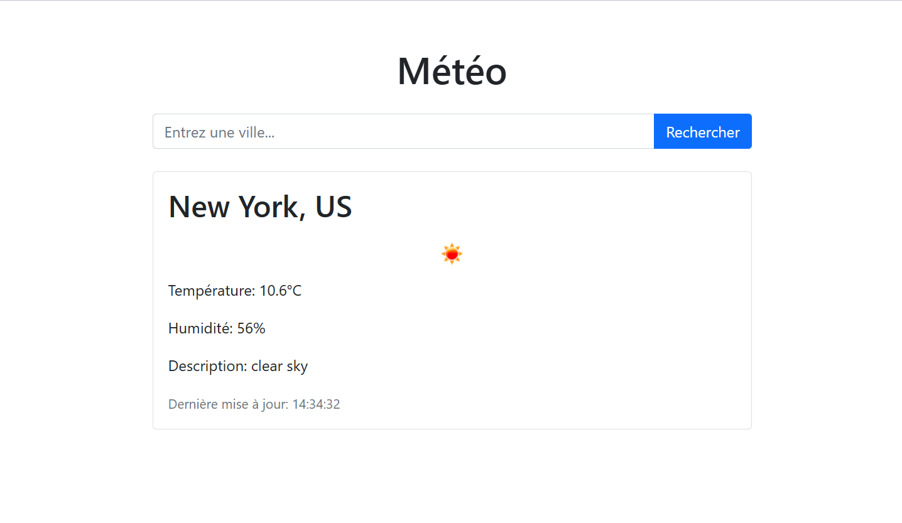

# Projets en python
Plusieurs petits projets permettant l'apprentissage du langage python ainsi que ses frameworks

# 1 - Student Management System 🧑‍🎓

Bienvenue dans **Student Management System** ! 🧑‍🎓 Ce projet est un outil simple en ligne de commande pour gérer une liste d'étudiants. Ce projet a été réaliser dans le but d'apprendre les concepts fondamentaux de la POO ainsi que la gestion de fichier notamment JSON. Ce projet aura potentiellement des fonctionnalités plus avancées 🚀. Ce projet a également pour but de mettre en oeuvre les bonnes pratiques en programmation python comme le clean code, l'archetecture ainsi que de savoir documenter et tester le code.

---

## 🛠️ Fonctionnalités

- ✏️ Ajouter un étudiant
- 🔍 Rechercher un étudiant par nom
- 🗑️ Supprimer un étudiant
- 📥 Importer et exporter des données en JSON/CSV
- 🎨 Interface utilisateur en ligne de commande stylisée avec [Rich](https://rich.readthedocs.io/)

---

# 2 - WeatherApp ☀️

WeatherApp est une application web développée avec le framework Python Flask. Elle permet aux utilisateurs de consulter la météo d'une ville en se connectant à l'API OpenWeatherMap.

## Technologies utilisées 🛠️

- **Python** 🐍 : Langage de programmation utilisé pour le backend de l'application.
- **Flask** 🌎 : Framework web Python utilisé pour construire l'application.
- **Requests** 🌐 : Bibliothèque Python pour effectuer des requêtes HTTP.
- **Python-Dotenv** 🔑 : Bibliothèque pour charger les variables d'environnement depuis un fichier `.env`.
